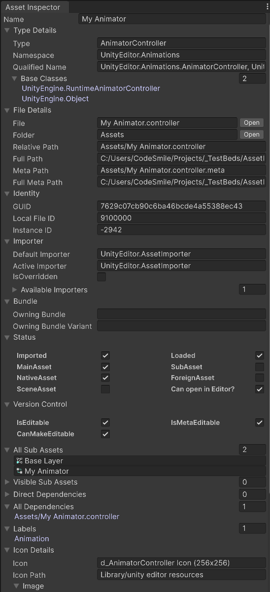

# CodeSmile Asset Inspector

Inspect all AssetDatabase details of selected assets. Great for researching and debugging! Also serves as a demo for [`CodeSmile AssetDatabase`](https://github.com/CodeSmile-0000011110110111/de.codesmile.editor.assetdatabase).

The Asset Inspector GUI was created with UI Toolkit's UI Builder.

## Documentation

None yet. It's self-explanatory. Be sure to check the tooltips.

## Requirements

- Unity 2021.3.3f1 or newer
- [`CodeSmile AssetDatabase`](https://github.com/CodeSmile-0000011110110111/de.codesmile.editor.assetdatabase)
- A smile :)

## Installation

This software is a Unity Package Manager 'npm package'.

- Open Window => Package Manager in Unity Editor
- Choose "Install package from git URL..."
- Enter: `https://github.com/CodeSmile-0000011110110111/de.codesmile.editor.assetdatabase.git`
- Choose "Install package from git URL..." again
- Enter: `https://github.com/CodeSmile-0000011110110111/de.codesmile.editor.assetinspector.git`

This package is currently not available on OpenUPM.

## GPL License

This software is licensed under the GNU General Public License v3.0 (GPL 3.0). The main implication is that any work you publish that uses this software requires the entire work to be published as open source software under the same GPL 3.0 license.

This software will also be available on the Unity Asset Store under the Asset Store EULA.

If you wish to license this software under different terms, for example to create Asset Store tools, please contact me!

- Steffen aka CodeSmile
- [Email](mailto:steffen@steffenitterheim.de) / [Discord](https://discord.gg/JN3Jz8qkeV)

## Support & Feeback

Very welcome! Please prefer to create an issue in the GitHub repository, specifically if you encounter issues or to request a feature. Contact me directly (see above) for any other feedback and questions.
